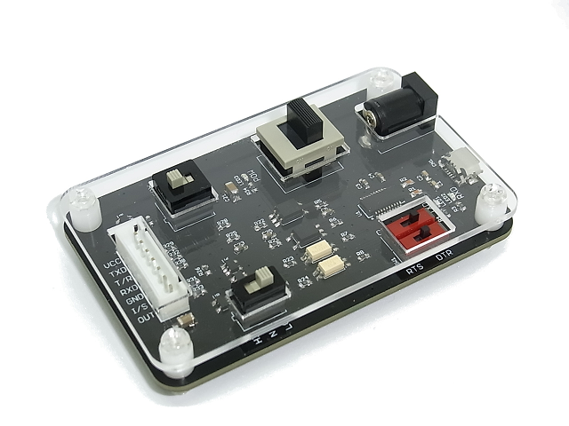
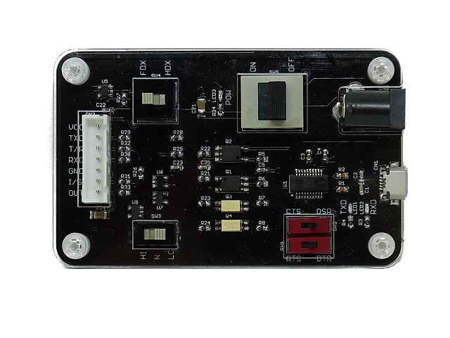

General Serial Communication Board
=========

  
The General Serial Communication Board is an USB to Serial converter with FTDI Chipset.  
Full/Half-duplex UART, DTR/RTS signals, and 3-position will be adapted microcontroller you may use.  
These features are useful for serial flash programming.  
This board also has opto-isolaters to prevent electrical shock, get rid of Ground Loop track and protect your computer.  

### Some highlights of the General Serial Communication Board:
 1. USB UART Bridge: FTDI FT231X Based on the popular FTDI FT231X converter
 2. UART interface circuit accepts 3.3V and 5.0V.
 3. Electrical isolation between UART interface and USB interface.
 4. All standard serial data rates and up to 3Mega baud.
 5. Full duplex mode and Half duplex mode are selectable(SW4).
 6. Flow control pins are avilable (DTR or RTS, SW1) and (DSR or CTS, SW2)
 7. 3-state user switch(SW3) connected to ftdi is selectable VCC, weak pulldown or GND.
 8. Measures 40mm x 80mm x 20mm

Repository Contents
-------------------
* **/Mechanical** - Mechanical data files (.dxf, .dwg)
* **/Hardware** - All Eagle design files (.brd, .sch)

Description(Pin Interfaces)
-------------------

### CN1(Primarily) Connector Descriptions:
Micro B-type usb connector

### CN2(Secondary) Connector Descriptions:
Barrel Power Jack socket
This socket is connected to VIN pin on CN3 with the main power switch(SW5).  
The power supply must follow microcontroller requirements.

### CN3(Secondary) Pin Descriptions:
This connector is for your target boart.
- **VIN:** UART interface power supply with a voltage range of 2.7 to 5.5VDC.
- **TX:** Full duplex TX signal(CMOS TTL output).
- **TX/RX:** Half duplex signals(Open collector output).
- **RX:** Full duplex RX signal.
- **GND:** GND.
- **I/S:** User switch (Active High signal) and input to DSR or CTS.
- **OUT:** DTR or RTS signal (Active High signal).

License Information
-------------------
The repository is released under [Creative Commons ShareAlike 4.0 International](https://creativecommons.org/licenses/by-sa/4.0/).

Distributed as-is; no warranty is given.
